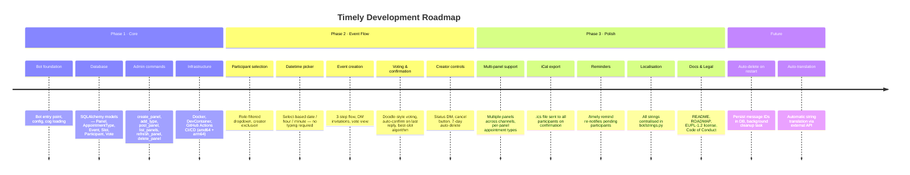

# Timely — Roadmap

## Status

| Feature | Status | Priority |
|---|---|---|
| Bot foundation & database | ✅ Done | P1 |
| Admin panel commands | ✅ Done | P1 |
| Docker + CI/CD | ✅ Done | P1 |
| Role-based access control | ✅ Done | P1 |
| 3-step event creation flow | ✅ Done | P2 |
| Select-based datetime picker | ✅ Done | P2 |
| Doodle-style voting | ✅ Done | P2 |
| Auto-confirmation & best-slot | ✅ Done | P2 |
| iCal export | ✅ Done | P3 |
| Multi-panel support | ✅ Done | P2 |
| Reminders | ✅ Done | P4 |
| Localisation (strings.py) | ✅ Done | P2 |
| Auto-delete persistence on restart | 🔲 Planned | P4 |
| Auto-translation | 🔲 Planned | P4 |
