# Timely — Roadmap

```mermaid
timeline
    title Timely Development Roadmap

    section Phase 1 · Core
        Bot foundation        : Bot entry point, config, cog loading
        Database              : SQLAlchemy models — Panel, AppointmentType, Event, Slot, Participant, Vote
        Admin commands        : create_panel, add_type, post_panel, list_panels, refresh_panel, delete_panel
        Infrastructure        : Docker, DevContainer, GitHub Actions CI/CD (amd64 + arm64)

    section Phase 2 · Event Flow
        Participant selection : Role-filtered dropdown, creator exclusion
        Datetime picker       : Select-based date / hour / minute — no typing required
        Event creation        : 3-step flow, DM invitations, vote view
        Voting & confirmation : Doodle-style voting, auto-confirm on last reply, best-slot algorithm
        Creator controls      : Status DM, cancel button, iCal export

    section Phase 3 · Polish & Management
        Multi-panel support   : Multiple panels across channels, per-panel appointment types
        Panel management      : edit_type, disable/enable, announce command
        Reminders             : /timely remind re-notifies pending participants
        Localisation          : All strings centralised in bot/strings.py

    section Phase 4 · Persistence & Reliability
        PostgreSQL + Alembic  : Production DB, schema migrations, entrypoint.sh
        Persistent views      : bot.add_view() on restart — buttons survive reboots
        DM auto-delete        : Message IDs in DB, hourly background cleanup task

    section Docs & Legal
        README + ROADMAP      : Full documentation, mascot intro, badges
        EUPL-1.2 license      : Copyright 2026 SirQuacksALot
        Code of Conduct       : Contributor Covenant 2.1

    section Future
        Cancel confirmed      : Organiser can cancel confirmed appointments, participant notification
        DB Backup & Restore   : /timely backup exports JSON.gz, /timely restore reimports with confirmation
        Auto-translation      : Automatic string translation via external API
```

## Status

| Feature | Status | Priority |
|---|---|---|
| Bot foundation & database | ✅ Done | P1 |
| Admin panel commands | ✅ Done | P1 |
| Docker + CI/CD | ✅ Done | P1 |
| PostgreSQL + Alembic | ✅ Done | P1 |
| Persistent views on restart | ✅ Done | P1 |
| Role-based access control | ✅ Done | P1 |
| 3-step event creation flow | ✅ Done | P2 |
| Select-based datetime picker | ✅ Done | P2 |
| Doodle-style voting | ✅ Done | P2 |
| Auto-confirmation & best-slot | ✅ Done | P2 |
| iCal export | ✅ Done | P2 |
| Multi-panel support | ✅ Done | P2 |
| edit_type / disable / enable | ✅ Done | P2 |
| /timely announce | ✅ Done | P2 |
| Rate limiting per button | ✅ Done | P2 |
| /timely status with filter | ✅ Done | P2 |
| Auto-cancel when all decline | ✅ Done | P1 |
| Reminders | ✅ Done | P3 |
| Localisation (strings.py) | ✅ Done | P3 |
| DM auto-delete persistence | ✅ Done | P4 |
| Cancel confirmed appointments | 🔲 Planned | P3 |
| DB Backup & Restore | 🔲 Planned | P2 |
| Auto-translation | 🔲 Planned | P4 |
